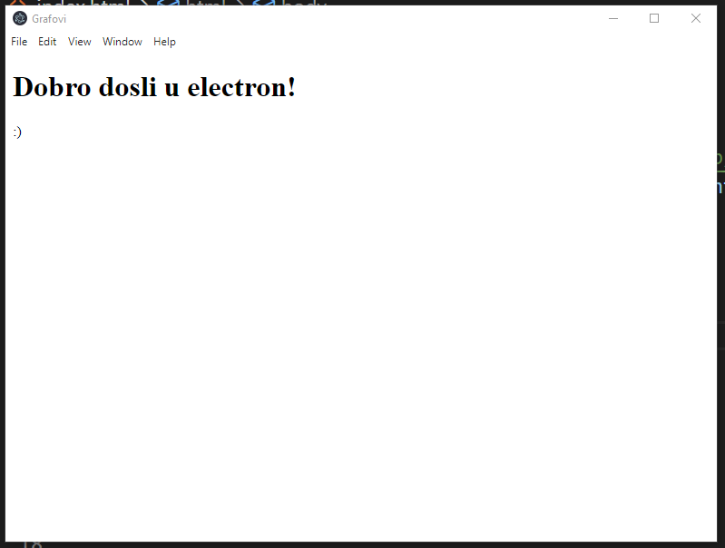

##Pokretanje projekta

#Napohodni programi za pokretanje
1. Node.js
2. Visual Studio Code

#Kako se pokrece projekat?
1. Kloirati projekat i otvoriti folder u VS Code-u
2. Otvritit terminal i kucati *npm install*
3. Kada se zavrsi komanda kreirace se node_modules folder. Sledece za kucanje je *npm start*. To je komanda za pokretanje aplikacije

``Izgled pokretnute aplikacije``
